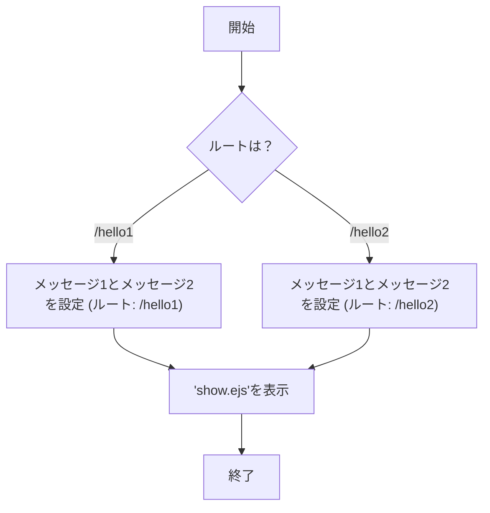
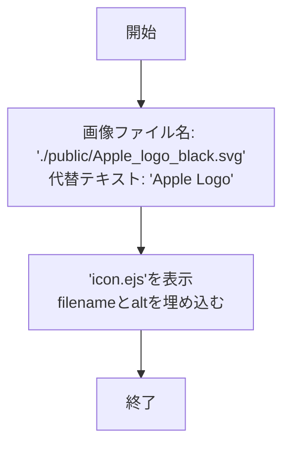
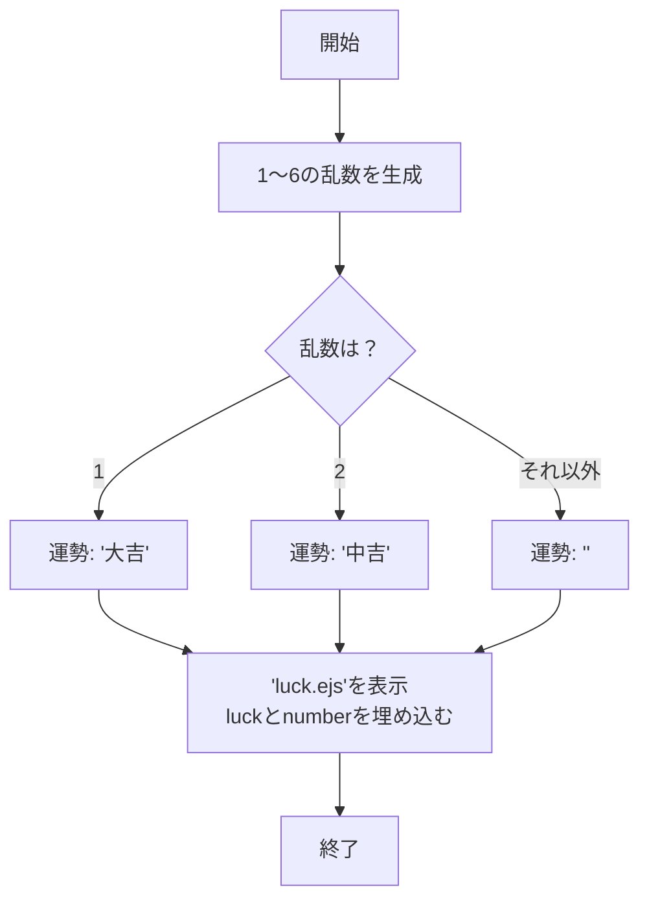
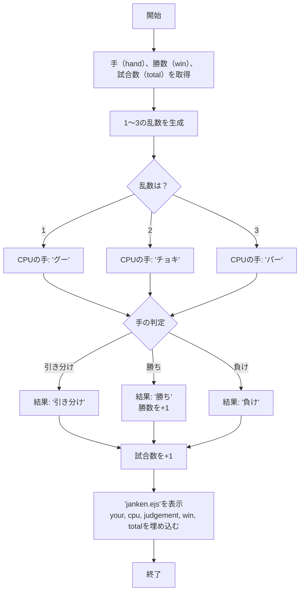
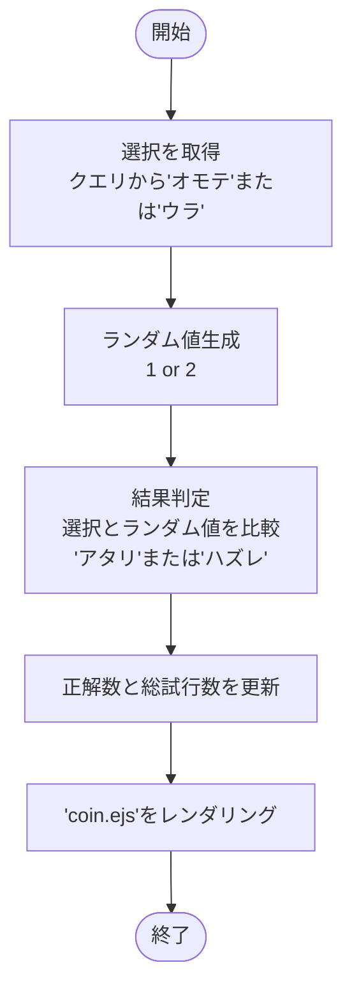
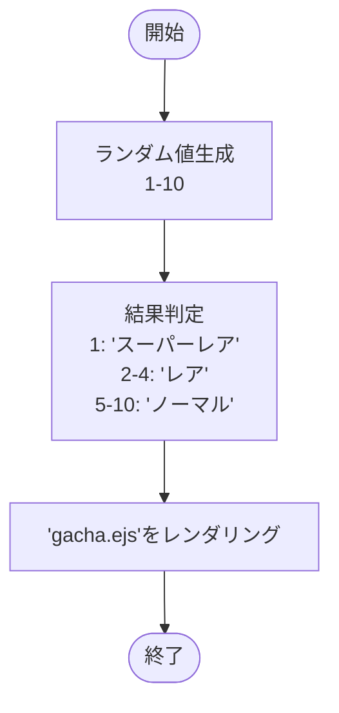
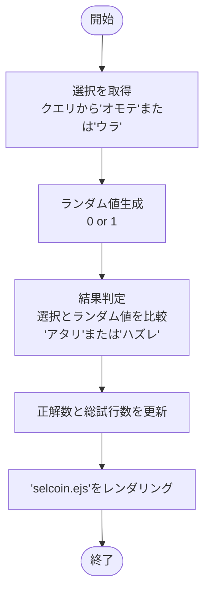

# webpro_06
2024年10月29日
## このプログラムについて
webpro_06 | 説明
-|-
app5.js | プログラム本体
views/show.ejs | メッセージの表示画面
views/luck.ejs | 運勢の表示画面
views/icon.ejs | 画像の表示画面
views/janken.ejs | じゃんけんの開始画面
views/coin.ejs | コイントスの選択画面
views/gacga.ejs | ガチャの開始画面
views/selcoin.ejs | スライダーによるコイントスの開始画面

## app5.jsについて

###  起動方法
ソースコードを示している場合、それを実行する。
1. Node.jsをインストールする
1. ローカルリポジトリを作成する
```c
git clone https://github.com/KugeRiku/webpro_06.git
cd webpro_06
```
3. パッケージをインストール
```c
npm install
```
4. アプリケーションを起動
```c
node app5.js
```
5. アプリケーションがポート8080で動作しているので、以下のURLにアクセスする
```
http://localhost:8080/<任意のパス>
```

### 編集したファイルのgit管理
ソースコードを示している場合、それを実行する．
1. 変更をステージに追加
```
git add .
```
2. 変更をコミットする
```
git commit -m "変更内容を説明するメッセージ"
```
3. リモートリポジトリにプッシュする
```
git push origin main
```

### 機能の説明と使用手順
#### 1 挨拶機能　(/hello1, /hello2)
説明: 挨拶のメッセージが表示される
使用手順: 
1. ブラウザで http://localhost:8080/hello1 または http://localhost:8080/hello2 にアクセス。
1. 「Hello world」「Bon jour」という挨拶メッセージが表示される。

#### 2 画像表示機能　(/icon)
説明: Appleのロゴ画像を表示する。
使用手順: 
1. ブラウザで http://localhost:8080/icon にアクセス。
1. Appleロゴが画面に表示する。

#### 3 おみくじ機能　(/luck)
説明: ランダムに生成した値に応じて、運勢を表示する。
使用手順: 
1. ブラウザで http://localhost:8080/luck にアクセス。
1. ランダムな運勢結果が画面に表示される。

#### 4 ジャンケン　(/janken)
説明: 自分が入力した手とコンピュータの手を比較し、じゃんけんの勝敗を判定する。
使用手順: 
1. ブラウザで http://localhost:8080/janken にアクセス。
1. コンピュータの手と勝敗が表示され、勝ち数と試合数が更新される。

#### 5 コイントス (/coin)
説明: 表または裏をボタンで選択し、ランダムに生成した値に応じて選択される表裏と比較して正解数を記録する。
使用手順: 
1. ブラウザで http://localhost:8080/coin にアクセス。
1. ランダムな結果が表示され、正解数と試行数が更新される。

#### 6 ガチャ (/gacha)
説明: ランダムに生成された数値に応じて、ガチャ結果を表示する。
使用手順: 
1. ブラウザで http://localhost:8080/gacha にアクセス。
1. ガチャ結果が画面に表示される。

#### 7 コイントス (/selcoin)
説明: 表または裏をスライダーで選択し、ランダムに生成した値に応じて選択される表裏と比較して正解数を記録する。
使用手順: 
1. ブラウザで http://localhost:8080/selcoin にアクセス。
1. ランダムな結果が表示され、正解数と試行数が更新される。


## フローチャート
/hello1, /hello2について

/iconについて

/luckについて

/jankenについて

/coinについて

/gachaについて

/selcoinについて
