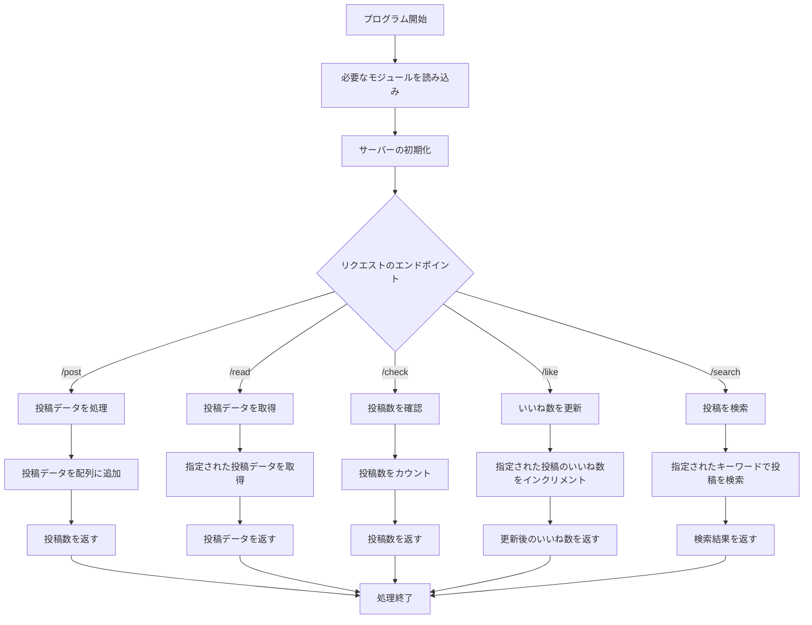

# webpro_06
2025年1月7日
## 掲示板アプリケーションのフローチャート

```mermaid
flowchart TD;

start["プログラム開始"] --> load["必要なモジュールを読み込み"];
load --> init["サーバーの初期化"];
init --> routeCheck{"リクエストのエンドポイント"};

routeCheck -->|/post| handlePost["投稿データを処理"];
routeCheck -->|/read| handleRead["投稿データを取得"];
routeCheck -->|/check| handleCheck["投稿数を確認"];
routeCheck -->|/like| handleLike["いいね数を更新"];
routeCheck -->|/search| handleSearch["投稿を検索"];

handlePost --> savePost["投稿データを配列に追加"];
savePost --> responsePost["投稿数を返す"];

handleRead --> fetchPosts["指定された投稿データを取得"];
fetchPosts --> responseRead["投稿データを返す"];

handleCheck --> countPosts["投稿数をカウント"];
countPosts --> responseCheck["投稿数を返す"];

handleLike --> updateLike["指定された投稿のいいね数をインクリメント"];
updateLike --> responseLike["更新後のいいね数を返す"];

handleSearch --> filterPosts["指定されたキーワードで投稿を検索"];
filterPosts --> responseSearch["検索結果を返す"];

responsePost --> end1["処理終了"];
responseRead --> end1;
responseCheck --> end1;
responseLike --> end1;
responseSearch --> end1;
```