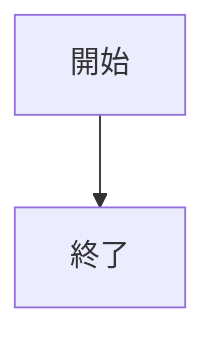
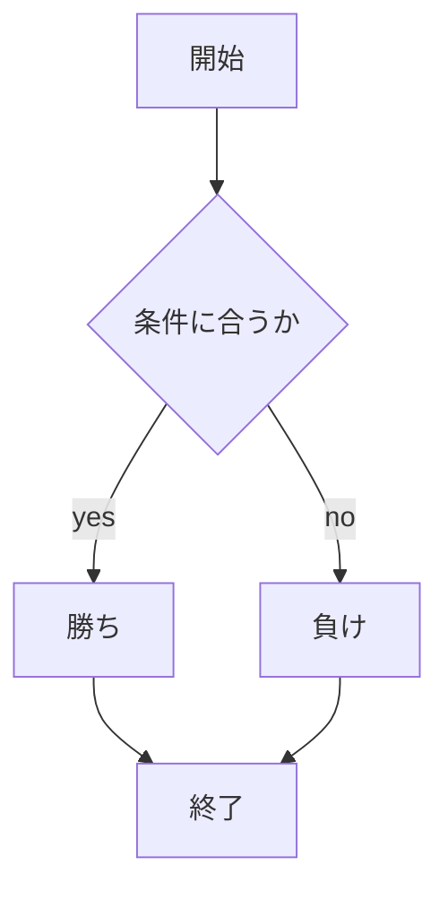

# webpro_06
2024年10月29日
## このプログラムについて
webpro_06 | 説明
-|-
app5.js | プログラム本体
public/janken.html | じゃんけんの開始画面
janken.ejs | スクリプト

## 使用方法
1. app5.jsを起動する
1. Webブラウザでlocalhost:8080/public/janken.htmlにアクセスする
1. 自分の手を入力する

## ファイル一覧

